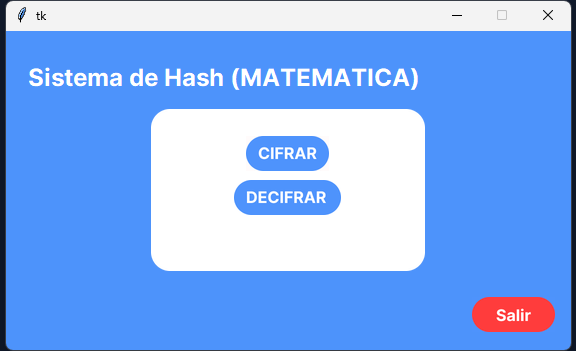

---
# https://vitepress.dev/reference/default-theme-home-page

layout: home

hero:
  name: "Instrucciones y explicacion appSha256"
  text: "proyecto precentado en python Matematicas"
  image: https://i.ibb.co/4jKyNBn/Inicio.png
  
  # actions:
  #   - theme: brand
  #     text: Markdown Examples
  #     link: /markdown-examples
  #   - theme: alt
  #     text: API Examples
  #     link: /api-examples
  actions:
    - theme: brand
      text: Como funciona
      link: /markdown-instrucciones
    - theme: brand
      text: Repocitorio
      link: "https://github.com/yamahac70/000.git"
    - theme: brand
      text: Descargar .exe
      link: https://github.com/yamahac70/proyecto_matematicas_sha256/releases/download/mjav1/matematicasHash256V1.1.exe
# features:
#   - title: Feature s
#     details: Lorem ipsum dolor sit amet, consectetur adipiscing elit
#   - title: Feature B
#     details: Lorem ipsum dolor sit amet, consectetur adipiscing elit
#   - title: Feature C
#     details: Lorem ipsum dolor sit amet, consectetur adipiscing elit
---
<!--  -->
