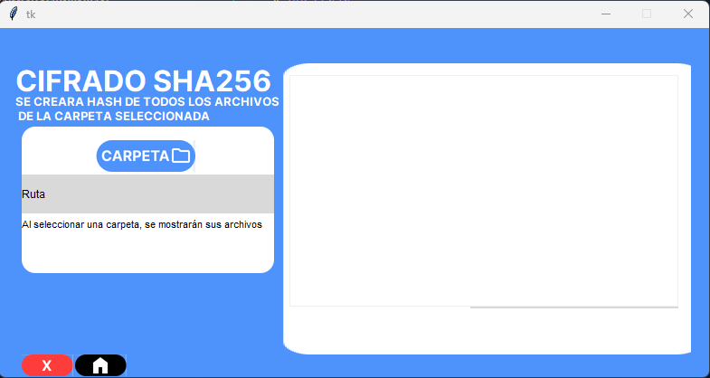
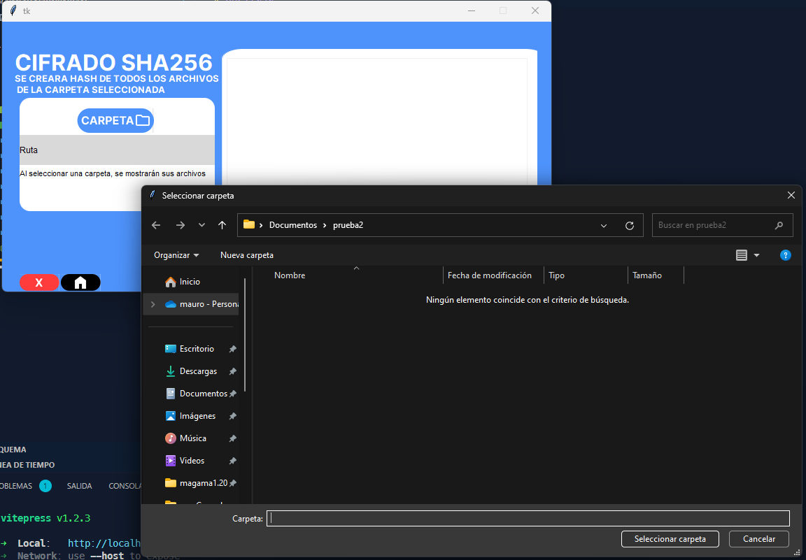
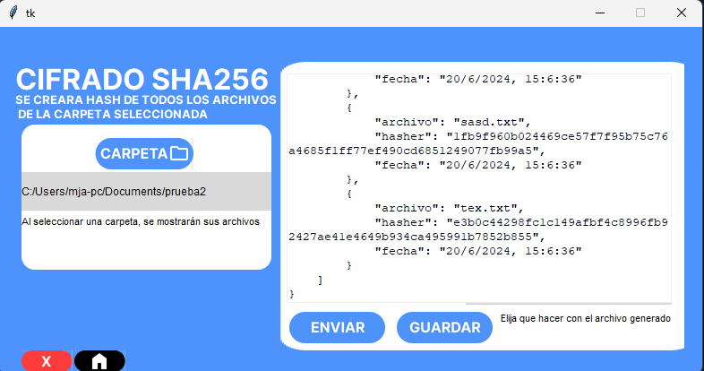
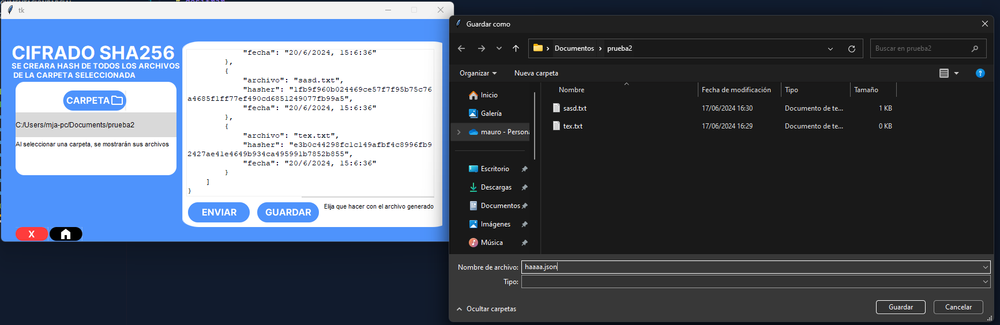

# Cifrar


## Inicio cifrado

## Seleccionar carpeta donde estan los archivos

####  Todos los archivos se generara los hash es decir 
```
--carpeta/
---archvo.txt
---archivo2.txt
```

---
# Genera json

### al generar el json se mostraran dos opciones nuevas que son 
- Enviar
    - enviara el archivo por correo electronico
- Guardar
    - Guardara el archivo localmente 

La estructura del json sera 

``` json
{
    "hashes": [
        {
            "archivo": "archivo.txt",
            "hasher": "1fb9f960b024469ce57f7f95b75c76a4685f1ff77ef490cd6851249077fb99a5",
            "fecha": "20/6/2024, 15:6:36"
        },
        {
            "archivo": "archivo2.txt",
            "hasher": "e3b0c44298fc1c149afbf4c8996fb92427ae41e4649b934ca495991b7852b855",
            "fecha": "20/6/2024, 15:6:36"
        }
    ]
}

```


