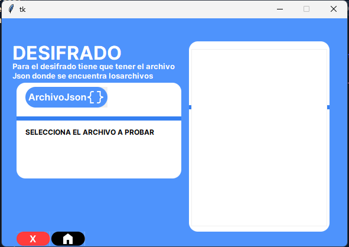
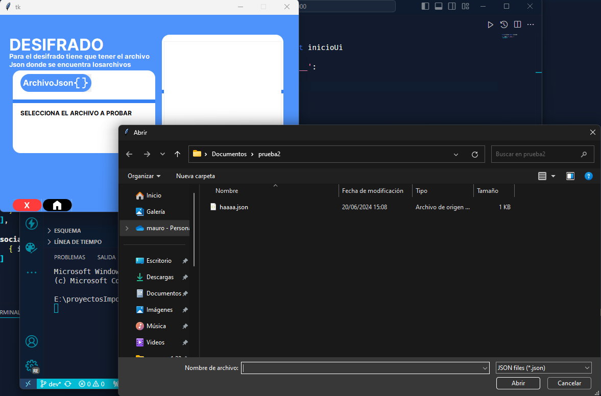
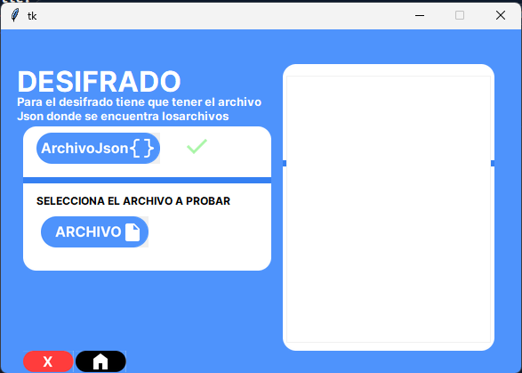
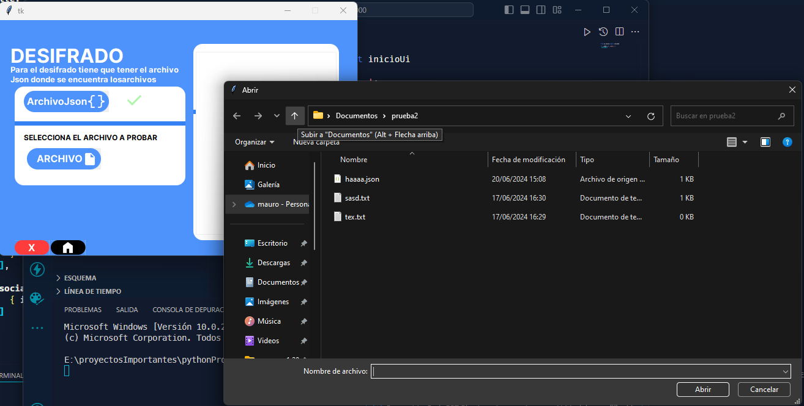
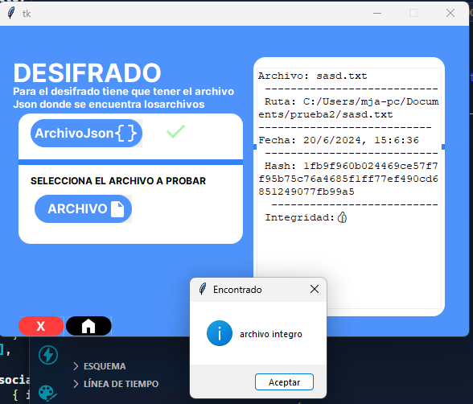
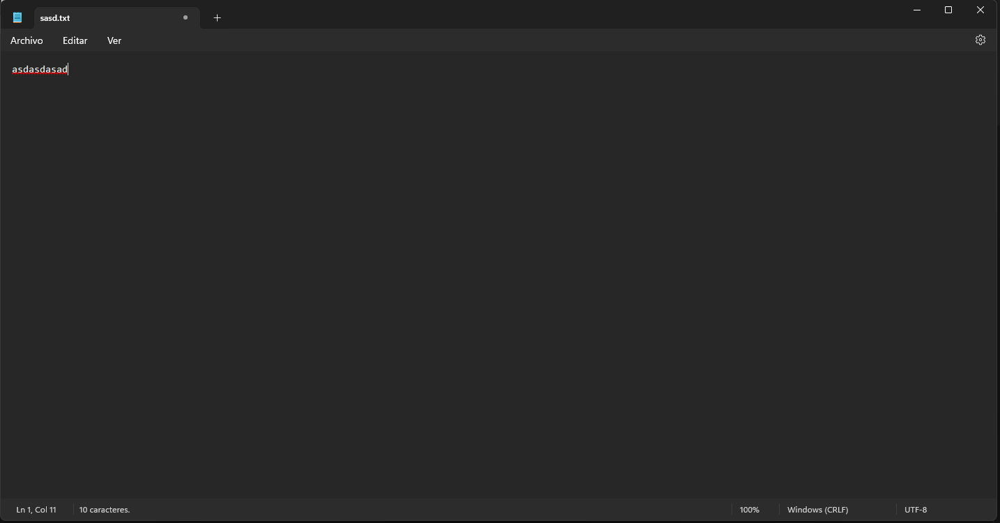
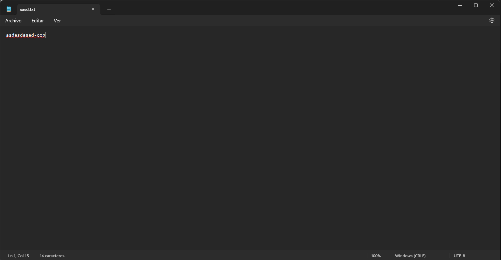
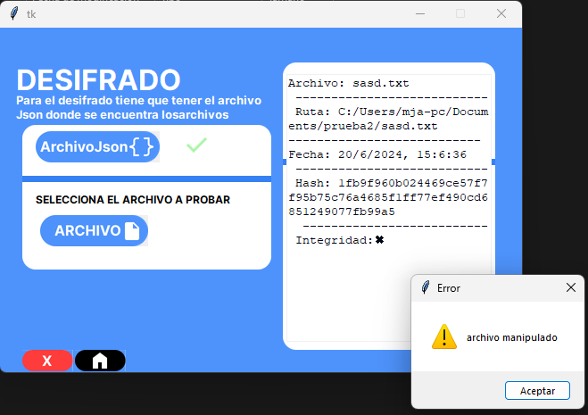

# Desifrar

## Ventana decifrar

en la pantalla se observa un boton de archivo Json donde cargaremos el .json que se genero anteriormente

## Carga de archivo JSON

## Seleccion de archivo

## Prueba de archivo
### Archivo integro

### Archivo manipulado

