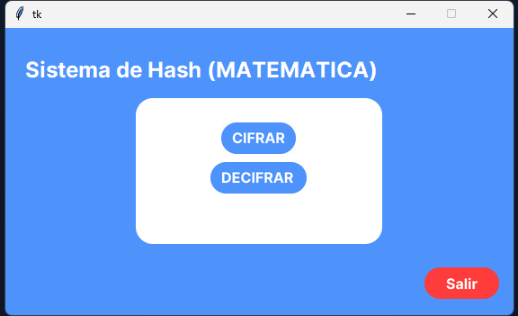

# Instrucciones de uso

## pantalla de inicio

- cifrar
    -  pantalla donde se mostrar las opciones para cifrar los archivos 
- Desifrar 
    -  pantalla donde se mostrar las opciones para compara los archivos con la base json que se genero 

actions:
    - theme: brand
      text: Documentacion
      link: /markdown-examples
    - theme: brand
      text: Repocitorio
      link: "https://github.com/yamahac70/000.git"
---